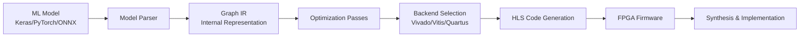

## What is hls4ml?

hls4ml is a package that converts machine learning models into highly optimized firmware implementations for FPGAs and ASICs using High-Level Synthesis (HLS). It enables ultra-low latency inference by translating neural networks into hardware descriptions that can be synthesized into custom accelerators.

<Note>
  hls4ml achieves inference latencies as low as a few nanoseconds by implementing neural networks directly in hardware logic, making it ideal for real-time applications in particle physics, edge computing, and low-power AI.
</Note>

## Architecture Overview

The hls4ml conversion pipeline transforms machine learning models through several stages:



### Conversion Pipeline Stages

<Steps>
  <Step title="Model Parsing">
    The framework-specific model (Keras, PyTorch, or ONNX) is parsed and converted into an internal graph representation. Each layer is mapped to an hls4ml layer type.
  </Step>
  
  <Step title="Graph IR Construction">
    An intermediate representation (IR) is built that captures the computational graph structure, layer connectivity, and data flow patterns independent of the original framework.
  </Step>
  
  <Step title="Optimization">
    Multiple optimization passes are applied:
    - Layer fusion (e.g., BatchNorm + Activation)
    - Precision inference and quantization
    - Resource allocation strategies
    - Memory optimization
  </Step>
  
  <Step title="Backend Code Generation">
    The optimized graph is translated to backend-specific HLS code (C++/SystemC) with appropriate pragmas and directives for the target tool.
  </Step>
  
  <Step title="Synthesis">
    The HLS code is synthesized into RTL (Register Transfer Level) description and implemented on the target FPGA.
  </Step>
</Steps>

## Key Components

### Model Graph

The `ModelGraph` class is the central data structure that represents the converted model:

```python
from hls4ml.model import ModelGraph

# After conversion, you get a ModelGraph instance
hls_model = hls4ml.converters.convert_from_keras_model(
    keras_model,
    hls_config=config,
    output_dir='my-hls-project',
    backend='Vivado'
)

# The graph maintains layer connectivity and attributes
for layer in hls_model.get_layers():
    print(f"Layer: {layer.name}, Type: {layer.class_name}")
```

Relevant code: `hls4ml/model/graph.py:1`

### Backends

Backends translate the internal representation to vendor-specific HLS:

- **Vivado HLS** - Xilinx FPGAs (legacy toolchain)
- **Vitis HLS** - Xilinx FPGAs (modern toolchain)
- **Quartus** - Intel/Altera FPGAs
- **Catapult HLS** - Siemens high-level synthesis
- **oneAPI** - Intel FPGA alternative flow

Each backend is registered and provides specific code generation templates:

```python
from hls4ml.backends import get_backend, get_available_backends

# List available backends
print(get_available_backends())
# ['vivado', 'vitis', 'quartus', 'catapult', 'oneapi']

# Get backend instance
backend = get_backend('Vivado')
```

Backend implementation: `hls4ml/backends/backend.py:17`

### Converters

Framework-specific converters handle model parsing:

- `keras_v2_to_hls` - TensorFlow/Keras 2.x models
- `keras_v3_to_hls` - Keras 3.x models
- `pytorch_to_hls` - PyTorch models via tracing
- `onnx_to_hls` - ONNX models

Each converter registers layer handlers for framework-specific operations:

```python
import hls4ml

# Keras conversion
hls_model = hls4ml.converters.convert_from_keras_model(
    model,
    hls_config=config,
    output_dir='keras-project',
    backend='Vivado'
)

# PyTorch conversion
hls_model = hls4ml.converters.convert_from_pytorch_model(
    pytorch_model,
    input_shape=(None, 16),
    hls_config=config,
    output_dir='pytorch-project',
    backend='Vivado'
)

# ONNX conversion
hls_model = hls4ml.converters.convert_from_onnx_model(
    onnx_model,
    hls_config=config,
    output_dir='onnx-project',
    backend='Vivado'
)
```

Converter registration: `hls4ml/converters/__init__.py:34`

## Workflow Example

Here's a complete example showing the typical workflow:

```python
import hls4ml
import tensorflow as tf
import numpy as np

# 1. Create or load your model
model = tf.keras.models.Sequential([
    tf.keras.layers.Dense(64, activation='relu', input_shape=(16,)),
    tf.keras.layers.Dense(32, activation='relu'),
    tf.keras.layers.Dense(10, activation='softmax')
])

# 2. Configure the conversion
config = hls4ml.utils.config_from_keras_model(
    model,
    granularity='name',
    default_precision='fixed<16,6>',
    default_reuse_factor=1
)

# 3. Convert to HLS
hls_model = hls4ml.converters.convert_from_keras_model(
    model,
    hls_config=config,
    output_dir='my-hls-project',
    backend='Vivado',
    board='pynq-z2',
    io_type='io_parallel'
)

# 4. Compile and test
hls_model.compile()

X_test = np.random.rand(100, 16)
y_keras = model.predict(X_test)
y_hls = hls_model.predict(X_test)

# 5. Build the firmware
hls_model.build(csim=True, synth=True)
```

## Design Philosophy

hls4ml is designed with several key principles:

### Layer-by-Layer Translation

Each neural network layer is mapped to a corresponding hardware function with specific precision, parallelism, and resource allocation. This modular approach allows fine-grained control over implementation trade-offs.

### Fixed-Point Arithmetic

To maximize efficiency and minimize resource usage, hls4ml uses fixed-point arithmetic instead of floating-point. Precision can be configured per-layer or per-tensor.

### Configurable Resource Usage

The **reuse factor** controls the trade-off between latency and resource usage. A reuse factor of 1 fully unrolls operations for minimum latency, while higher values serialize computations to save resources.

### Multiple Implementation Strategies

- **Latency** - Fully pipelined, minimum latency
- **Resource** - Serialized computation, minimum resource usage
- **Resource Unrolled** - Balanced approach with configurable parallelism

## Next Steps

<CardGroup cols={2}>
  <Card title="Model Conversion" icon="arrows-rotate" href="./model-conversion">
    Learn how to configure and convert your models
  </Card>
  
  <Card title="HLS Backends" icon="microchip" href="./hls-backends">
    Understand the different backend options
  </Card>
  
  <Card title="Precision Optimization" icon="gauge-high" href="./precision-optimization">
    Master fixed-point precision configuration
  </Card>
  
  <Card title="API Reference" icon="code" href="/api/overview">
    Explore the complete API documentation
  </Card>
</CardGroup>